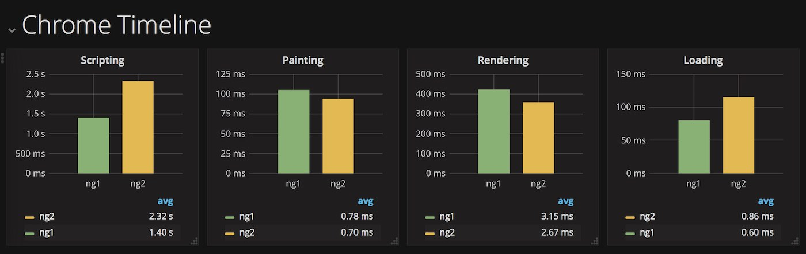

# Chrometrace-sitespeed.io-plugin

Expose [devtools-timeline](https://www.npmjs.com/package/devtools-timeline-model) data to [sitespeed.io](https://www.sitespeed.io).



## Install

```shell
npm install chrometrace-sitespeedio-plugin
```

## Usage

### Sitespeed.io

```shell
sitespeed.io -n 1 \
    --plugins.load ./node_modules/chrometrace-sitespeedio-plugin \
    --browsertime.chrome.collectTracingEvents \
    https://mobile.twitter.com/sitespeedio
```

### Docker

```shell
docker run --rm -v "$(pwd)/node_modules":/node_modules \
    sitespeedio/sitespeed.io \
    --plugins.load /node_modules/chrometrace-sitespeedio-plugin \
    --browsertime.chrome.collectTracingEvents \
    https://mobile.twitter.com/sitespeedio
```
